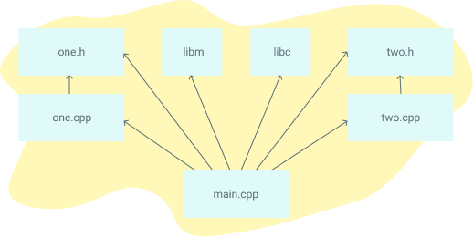

I built this guide because I could never quite wrap my head around Makefiles. They seemed awash with hidden rules and esoteric symbols, and asking simple questions didn’t yield simple answers. To solve this, I sat down for several weekends and read everything I could about Makefiles. I've condensed the most critical knowledge into this guide. Each topic has a brief description and a self contained example that you can run yourself.

If you mostly understand Make, consider checking out the Makefile Cookbook, which has a template for medium sized projects with ample comments about what each part of the Makefile is doing.

Good luck, and I hope you are able to slay the confusing world of Makefiles!

# Getting Started

## Why do Makefiles exist?

Makefiles are used to help decide which parts of a large program need to be recompiled. In the vast majority of cases, C or C++ files are compiled. Other languages typically have their own tools that serve a similar purpose as Make. It can be used beyond programs too, when you need a series of instructions to run depending on what files have changed. This tutorial will focus on the C/C++ compilation use case.

Here's an example dependency graph that you might build with Make. If any file's dependencies changes, then the file will get recompiled:



## What alternatives are there to Make?

Popular C/C++ alternative build systems are SCons, CMake, Bazel, and Ninja. Some code editors like Microsoft Visual Studio have their own built in build tools. For Java, there's Ant, Maven, and Gradle. Other languages like Go and Rust have their own build tools.

Interpreted languages like Python, Ruby, and Javascript don't require an analogue to Makefiles. The goal of Makefiles is to compile whatever files need to be compiled, based on what files have changed. But when files in interpreted languages change, nothing needs to get recompiled. When the program runs, the most recent version of the file is used.

## Running the Examples

To run these examples, you'll need a terminal and "make" installed. For each example, put the contents in a file called Makefile, and in that directory run the command make. Let's start with the simplest of Makefiles:

```makefile
hello:
    echo "hello world"
```


Here is the output of running the above example:

```
$ make
echo "hello world"
hello world
```

That's it! If you're a bit confused, here's a video that goes through these steps, along with describing the basic structure of Makefiles.

## Makefile Syntax

A Makefile consists of a set of rules. A rule generally looks like this:

```makefile
targets: prerequisites
   command
   command
   command
```

* The targets are file names, separated by spaces. Typically, there is only one per rule.
* The commands are a series of steps typically used to make the target(s). These need to start with a tab character, not spaces.
* The prerequisites are also file names, separated by spaces. These files need to exist before the commands for the target are run. These are also called dependencies

## Beginner Examples

The following Makefile has three separate rules. When you run make blah in the terminal, it will build a program called blah in a series of steps:

* Make is given **blah** as the target, so it first searches for this target
* **blah** requires **blah.o**, so make searches for the **blah.o** target
* **blah.o** requires **blah.c**, so make searches for the **blah.c** target
* **blah.c **has no dependencies, so the echo command is run
* The **cc -c** command is then run, because all of the **blah.o** dependencies are finished
* The top **cc** command is run, because all the **blah** dependencies are finished
* That's it: **blah** is a compiled c program

```makefile
blah: blah.o
    cc blah.o -o blah # Runs third

blah.o: blah.c
    cc -c blah.c -o blah.o # Runs second

blah.c:
    echo "int main() { return 0; }" > blah.c # Runs first
```

This makefile has a single target, called some_file. The default target is the first target, so in this case some_file will run.

```makefile
some_file:
    echo "This line will always print"
```

This file will make some_file the first time, and the second time notice it's already made, resulting in make: 'some_file' is up to date.

```makefile
some_file:
    echo "This line will only print once"
    touch some_file
```

Here, the target some_file "depends" on other_file. When we run make, the default target (some_file, since it's first) will get called. It will first look at its list of dependencies, and if any of them are older, it will first run the targets for those dependencies, and then run itself. The second time this is run, neither target will run because both targets exist.

```makefile
some_file: other_file
    echo "This will run second, because it depends on other_file"
    touch some_file

other_file:
    echo "This will run first"
    touch other_file
```

This will always run both targets, because some_file depends on other_file, which is never created.

```makefile
some_file: other_file
    touch some_file

other_file:
    echo "nothing"
```

clean is often used as a target that removes the output of other targets, but it is not a special word in make.

```makefile
some_file: 
    touch some_file

clean:
    rm -f some_file
```

## Variables

Variables can only be strings. Here's an example of using them:

```makefile
files = file1 file2
some_file: $(files)
    echo "Look at this variable: " $(files)
    touch some_file

file1:
    touch file1
file2:
    touch file2

clean:
    rm -f file1 file2 some_file
```

Reference variables using ${} or $()

```makefile
x = dude

all:
    echo $(x)
    echo ${x}

    # Bad practice, but works
    echo $x
```

# Targets

## The all target

Making multiple targets and you want all of them to run? Make an all target.

```makefile
all: one two three

one:
    touch one
two:
    touch two
three:
    touch three

clean:
    rm -f one two three
```

## Multiple targets

When there are multiple targets for a rule, the commands will be run for each target
$@ is an automatic variable that contains the target name.

```makefile
all: f1.o f2.o

f1.o f2.o:
    echo $@
# Equivalent to:
# f1.o
#     echo $@
# f2.o
#     echo $@
```

# Automatic Variables and Wildcards

## \* Wildcard

Both **\*** and **%** are called wildcards in Make, but they mean entirely different things. * searches your filesystem for matching filenames. I suggest that you always wrap it in the wildcard function, because otherwise you may fall into a common pitfall described below. It's oddly unhelpful and I find it more confusing than useful.

```makefile
# Print out file information about every .c file
print: $(wildcard *.c)
    ls -la  $?
```

**\*** may be used in the target, prerequisites, or in the wildcard function.

Danger: **\*** may not be directly used in a variable definitions

Danger: When **\*** matches no files, it is left as it is (unless run in the wildcard function)

```makefile
thing_wrong := *.o # Don't do this! '*' will not get expanded
thing_right := $(wildcard *.o)

all: one two three four

# Fails, because $(thing_wrong) is the string "*.o"
one: $(thing_wrong)

# Stays as *.o if there are no files that match this pattern :(
two: *.o 

# Works as you would expect! In this case, it does nothing.
three: $(thing_right)

# Same as rule three
four: $(wildcard *.o)
```

## % Wildcard

% is really useful, but is somewhat confusing because of the variety of situations it can be used in.

* When used in "matching" mode, it matches one or more characters in a string. This match is called the stem.
* When used in "replacing" mode, it takes the stem that was matched and replaces that in a string.
* % is most often used in rule definitions and in some specific functions.

See these sections on examples of it being used:

* Static Pattern Rules
* Pattern Rules
* String Substitution
* The vpath Directive


## Automatic Variables

There are many automatic variables, but often only a few show up:

```makefile
hey: one two
    # Outputs "hey", since this is the first target
    echo $@

    # Outputs all prerequisites newer than the target
    echo $?

    # Outputs all prerequisites
    echo $^

    touch hey

one:
    touch one

two:
    touch two

clean:
    rm -f hey one two
```

# Fancy Rules

## Static Pattern Rules

Make loves c compilation. And every time it expresses its love, things get confusing. Here's the syntax for a new type of rule called a static pattern:

``` makefile
targets ...: target-pattern: prereq-patterns ...
   commands
```

The essence is that the given target is matched by the target-pattern (via a % wildcard). Whatever was matched is called the stem. The stem is then substituted into the prereq-pattern, to generate the target's prereqs.

A typical use case is to compile .c files into .o files. Here's the manual way:

```makefile
objects = foo.o bar.o all.o
all: $(objects)

# These files compile via implicit rules
foo.o: foo.c
bar.o: bar.c
all.o: all.c

all.c:
    echo "int main() { return 0; }" > all.c

%.c:
    touch $@

clean:
    rm -f *.c *.o all
```

Here's the more efficient way, using a static pattern rule:

```makefile
objects = foo.o bar.o all.o
all: $(objects)

# These files compile via implicit rules
# Syntax - targets ...: target-pattern: prereq-patterns ...
# In the case of the first target, foo.o, the target-pattern matches foo.o and sets the "stem" to be "foo".
# It then replaces the '%' in prereq-patterns with that stem
$(objects): %.o: %.c

all.c:
    echo "int main() { return 0; }" > all.c

%.c:
    touch $@

clean:
    rm -f *.c *.o all
```

## Static Pattern Rules and Filter

While I introduce functions later on, I'll foreshadow what you can do with them. The filter function can be used in Static pattern rules to match the correct files. In this example, I made up the .raw and .result extensions.

```makefile
obj_files = foo.result bar.o lose.o
src_files = foo.raw bar.c lose.c

all: $(obj_files)

$(filter %.o,$(obj_files)): %.o: %.c
    echo "target: $@ prereq: $<"
$(filter %.result,$(obj_files)): %.result: %.raw
    echo "target: $@ prereq: $<" 

%.c %.raw:
    touch $@

clean:
    rm -f $(src_files)
```

## Implicit Rules

Perhaps the most confusing part of make is the magic rules and variables that are made. Here's a list of implicit rules:

* Compiling a C program: n.o is made automatically from n.c with a command of the form $(CC) -c $(CPPFLAGS) $(CFLAGS)
* Compiling a C++ program: n.o is made automatically from n.cc or n.cpp with a command of the form $(CXX) -c $(CPPFLAGS) $(CXXFLAGS)
* Linking a single object file: n is made automatically from n.o by running the command $(CC) $(LDFLAGS) n.o $(LOADLIBES) $(LDLIBS)

As such, the important variables used by implicit rules are:

* CC: Program for compiling C programs; default cc
* CXX: Program for compiling C++ programs; default G++
* CFLAGS: Extra flags to give to the C compiler
* CXXFLAGS: Extra flags to give to the C++ compiler
* CPPFLAGS: Extra flags to give to the C preprocessor
* LDFLAGS: Extra flags to give to compilers when they are supposed to invoke the linker

```makefile
CC = gcc # Flag for implicit rules
CFLAGS = -g # Flag for implicit rules. Turn on debug info

# Implicit rule #1: blah is built via the C linker implicit rule
# Implicit rule #2: blah.o is built via the C compilation implicit rule, because blah.c exists
blah: blah.o

blah.c:
    echo "int main() { return 0; }" > blah.c

clean:
    rm -f blah*
```

## Pattern Rules

Pattern rules are often used but quite confusing. You can look at them as two ways:

* A way to define your own implicit rules
* A simpler form of static pattern rules

Let's start with an example first:

```makefile
# Define a pattern rule that compiles every .c file into a .o file
%.o : %.c
  $(CC) -c $(CFLAGS) $(CPPFLAGS) $< -o $@
```

Pattern rules contain a '%' in the target. This '%' matches any nonempty string, and the other characters match themselves. ‘%’ in a prerequisite of a pattern rule stands for the same stem that was matched by the ‘%’ in the target.

Here's another example:

```makefile
# Define a pattern rule that has no pattern in the prerequisites.
# This just creates empty .c files when needed.
%.c:
   touch $@
```

## Double-Colon Rules

Double-Colon Rules are rarely used, but allow multiple rules to be defined for the same target. If these were single colons, a warning would be printed and only the second set of commands would run.

```makefile
all: blah

blah::
    echo "hello"

blah::
    echo "hello again"
```

# Commands and execution

## Command Echoing/Silencing

Add an @ before a command to stop it from being printed
You can also run make with -s to add an @ before each line

```makefile
all: 
    @echo "This make line will not be printed"
    echo "But this will"
```

## Command Execution

Each command is run in a new shell (or at least the effect is as such)

```makefile
all: 
  cd ..
  # The cd above does not affect this line, because each command is effectively run in a new shell
  echo `pwd`

  # This cd command affects the next because they are on the same line
  cd ..;echo `pwd`

  # Same as above
  cd ..; \
  echo `pwd`
```

## Default Shell

The default shell is /bin/sh. You can change this by changing the variable SHELL:

```
SHELL=/bin/bash

cool:
    echo "Hello from bash"
```

# Functions

## First Functions

Functions are mainly just for text processing. Call functions with $(fn, arguments) or ${fn, arguments}. You can make your own using the call builtin function. Make has a decent amount of [builtin functions](https://www.gnu.org/software/make/manual/html_node/Functions.html).

```makefile
bar := ${subst not, totally, "I am not superman"}
all: 
    @echo $(bar)

```

If you want to replace spaces or commas, use variables

```makefile
comma := ,
empty:=
space := $(empty) $(empty)
foo := a b c
bar := $(subst $(space),$(comma),$(foo))

all: 
    @echo $(bar)
```

Do NOT include spaces in the arguments after the first. That will be seen as part of the string.

```makefile
comma := ,
empty:=
space := $(empty) $(empty)
foo := a b c
bar := $(subst $(space), $(comma) , $(foo))

all: 
    # Output is ", a , b , c". Notice the spaces introduced
    @echo $(bar)
```

