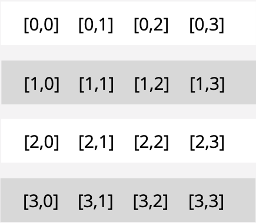
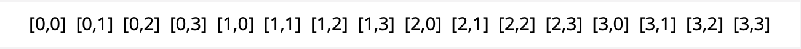
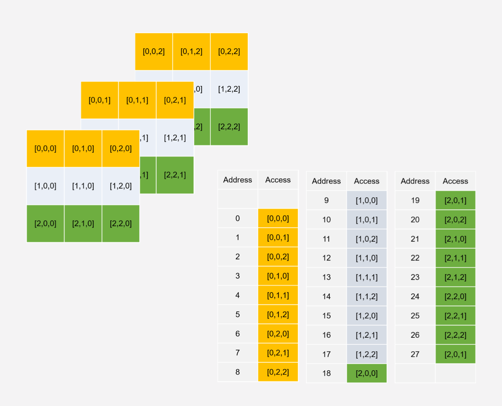
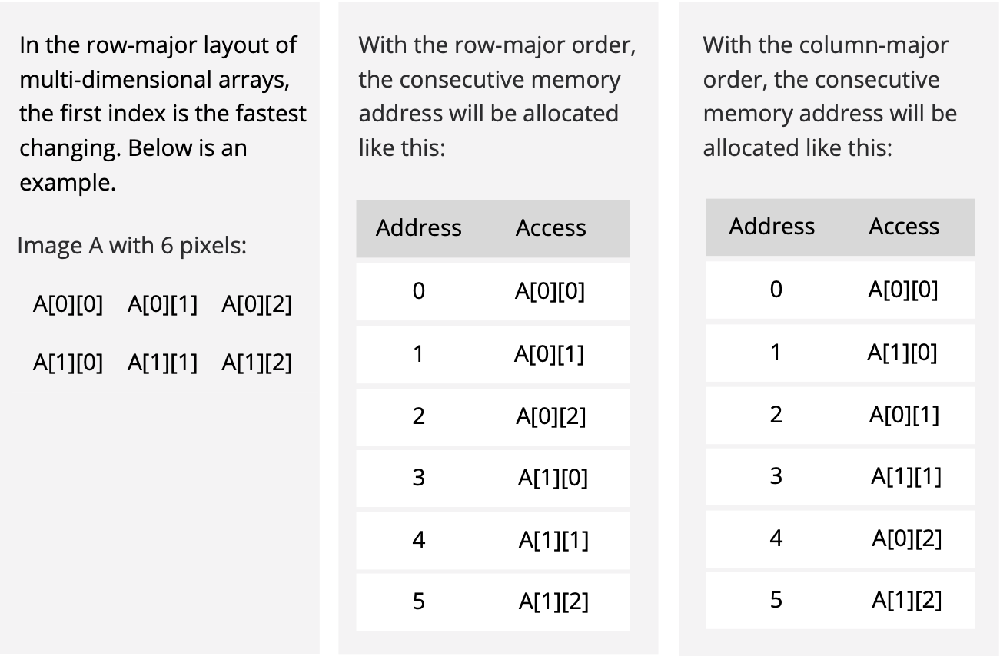
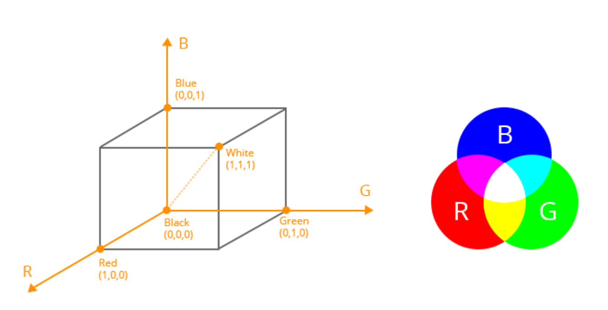
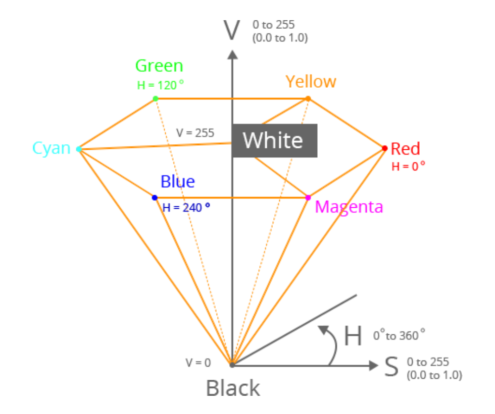
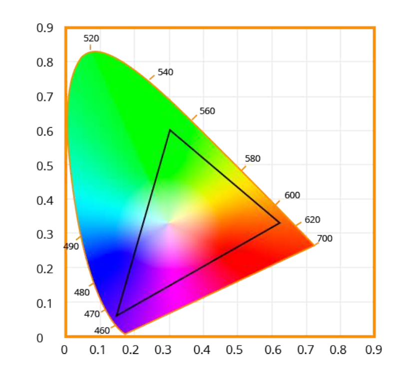
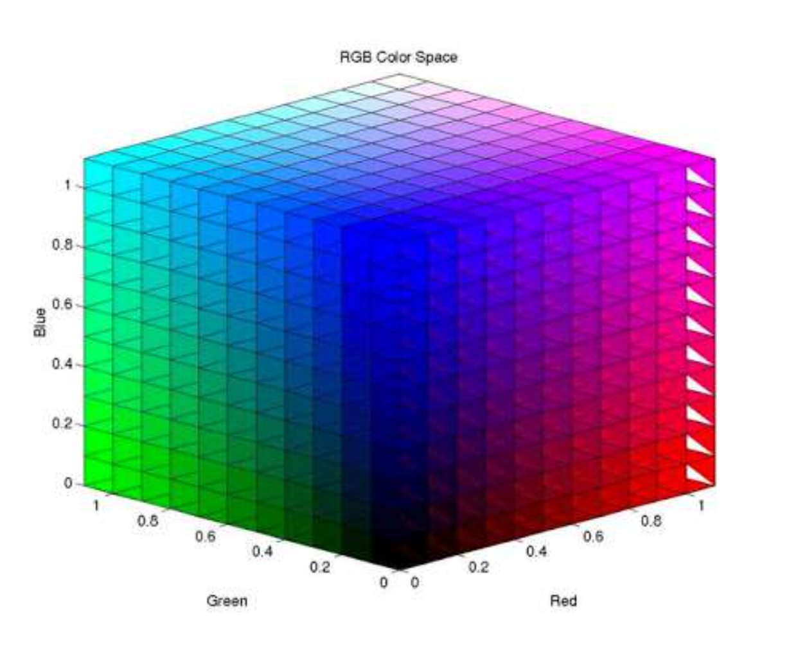

# CHAPTER 1.1 What is an Image?

Image processing and computer vision are hot trends in computer science that continue to show strong signs of momentum into the future due to their wide application and optimistic development prospects. In the first post of this blog series, we introduce the fundamentals of image processing by looking at what are images and how images are stored.

Digital images can be displayed and processed on a computer and can be divided into two broad categories based on their characteristics – bitmaps and vector images.

Bitmaps are based on pixel patterns that are usually represented by a digital array. BMP, PNG, JPG, and GIF are bitmaps.

Vector images an infinitely scalable and do not have any pixels since they use mathemati- cal formulas to draw lines and curves. A bitmap image of size M × N is composed of finite elements of M rows and N columns. Each element has a specific position and amplitude, representing the information at the position, such as grayscale and color. These elements are called image elements or pixels, if you want to read about it check out [fifthgeek.com](https://www.fifthgeek.com/).

## Color Space

Depending on the information represented by each pixel, images can be divided into binary images, grayscale images, RGB images, and index images, etc.

### 1. Binary Image

In a binary image, the pixel value is represented by a 0 or 1. Generally, 0 is for black and 1 is for white.

### 2. Grayscale Image

The grayscale image adds a color depth between black and white in the binary image to form a grayscale image. Such images are usually displayed as grayscales from the dark- est black to the brightest white, and each color depth is called a grayscale, usually denoted by L. In grayscale images, pixels can take integer values between 0 and L-1.

### 3. RGB Image

In RGB or color, images, the information for each pixel requires a tuple of numbers to represent. So we need a three-dimensional matrix to represent an image. Almost all colors in nature can be composed of three colors: red (R), green (G), and blue (B). So each pixel can be represented by a red/green/blue tuple in an RGB image.

### 4. Indexed Image

An indexed image consists of a colormap matrix, which uses direct mapping of pixel values in an array to colormap values. The color of each pixel in an image is determined by using the corre- sponding value. We discuss this in more detail below.

## How an Image is Stored in Memory

The x86 hardware does not have an addressing mode that accesses elements of multi-dimensional arrays. When loading an image into memory space, the multi-di- mensional object is converted into a one-dimensional array. **Row major ordering** or **column major ordering** are commonly used.

### Row Major Ordering

C/C++ and Python employ row-major ordering. It starts with the first row and then concatenates the second row to its end, then the third row, etc. This means that in a row-major layout, the last index is the fastest changing. In the case of matrices, the last index is columns.

For grayscale images, we can use a matrix to represent the level of gray at each pixel. Take a 4*4 image for example.

**Pixels by row and column:**

Memory:

For color images, we need multi-dimensional arrays to store the image information.

### Column-Major Ordering:

## How an Image is Stored in Files

### True Color (24-bit)

24-bit images commonly use 8 bits of each of R, G, and B. For each of the three primary colors, like grayscale, L levels can be used to indicate how much of this color component is present. For example, for a red color with 256 levels, 0 means no red color and 255 means 100% red. Similarly, green and blue can be divided into 256 levels. Each primary color can be represented by an 8-bit binary data, so the total of 3 primary colors requires 24 bits.

The uncompressed raw BMP file is an RGB image stored using the RGB standard.

### Indexed Color

For a color image with a height and width of 200 pixels and 16 colors, each pixel is represented by three components of RGB. Thus each pixel is represented by 3 bytes and the entire image is 200 × 200 × 3 = 120KB. Since there are only 16 colors in the color image, you can save the RGB values of these 16 colors with a color table (a 16 × 3 two-dimensional array). We discuss this in further detail below. Every element in the array represents a color, indexed by its position within the array. The image pixels do not contain the full specification of its color, but only its index in the table. For example, if the third element in the color table is 0xAA1111, then all pixels with a color of 0xAA1111 can be represented by “2” (the color table index subscript starts at 0). This way, each pixel requires only 4 bits (0.5 bytes), so the entire image can be stored at 200 × 200 × 0. 5 = 20 KB. The color table referred to above is the palette, which is also often called Look Up Table (LUT).

GIF is the most representative image file format that supports indexed color modes.

# CHAPTER 1.2 Color Models?

## What is a Color Model?

A color model is an abstract mathematical model that describes how colors can be represented as a set of numbers (e.g., a triple in RGB or a quad in CMYK). Color models can usually be described using a coordinate system, and each color in the system is represented by a single point in the coordinate space.

For a given color model, to interpret a tuple or quad as a color, we can define a set of rules and definitions used to accurately calibrate and generate colors, i.e. a mapping function. A color space identifies a specific combination of color models and mapping functions. Identifying the color space automatically identifies the associated color model. For example, Adobe RGB and sRGB are two different color spaces, both based on the RGB color model.

## RGB

RGB color model stores individual values for red, green, and blue. With a color space based on the RGB color model, the three primaries are added together to create colors from completely white to completely black.

The RGB color space is associated with the device. Thus, different scanners get different color image data when scanning the same image; different monitors have different color display results when rendering the same image.

There are many different RGB color spaces derived from this color model, standard RGB (sRGB) is a popular example.

## HSV

HSV (hue, saturation, value), also known as HSB (hue, saturation, brightness), is often used by artists because it is often more natural to think about a color in terms of hue and saturation than in terms of additive or subtractive color components.

The system is closer to people’s experience and perception of color than RGB. In painting terms, hue, saturation, and values are expressed in terms of color, shading, and toning.

The HSV model space can be described by an inverted hexagonal pyramid.

> The top surface is a regular hexagon, showing the change in hue in the H direction, from 0 ° to 360 ° is the entire spectrum of visible light. The six corners of the hexagon represent the positions of the six colors of red, yellow, green, cyan, blue, and magenta, each of which is 60 ° apart.

>  The saturation S is represented by the S direction from the center to the hexagonal boundary, and the value varies from 0 to 1. The closer to the hexagonal boundary, the higher the color saturation. The color of the hexagonal boundary is the most saturated, ie S = 1; the color saturation at the center of the hexagon is 0, ie S = 0.

>  The height of the hexagonal pyramid (also known as the central axis) is denoted by V, which represents a black to white gradation from bottom to top. The bottom of V is black, V = 0; the top of V is white, V = 1.

## YUV

The Y′UV model defines a color space in terms of one luma component (Y′) and two chrominance (UV) components. The Y′ channel saves black and white data. If there is only the Y component and there are no U and V components, then the graph represented is grayscale.

The Y component can be calculated with the following equation: Y = 0. 299*R+ 0. 587*G+ 0. 114*B, which is the commonly used grayscale formula. The color difference U and V are compressed by B-Y and R-Y in different proportions.

Compared with RGB, Y’UV does not necessarily store a triple tuple for each pixel. Y′UV images can be sampled in several different ways. For example, with YUV420, it saves one luma component for every point and two chroma values—a Cr (U) value and a Cb (V) value—every 2×2 points. I.E. 6 bytes per 4 pixels.

The scope of the terms Y′UV, YUV, YCbCr, YPbPr, etc., is sometimes ambiguous and overlapping. Historically, the terms YUV and Y′UV were used for a specific analog encoding of color information in television systems, while YCbCr was used for digital encoding of color information suited for video and still-image compression and transmission such as MPEG and JPEG. Today, the term YUV is commonly used in the computer industry to describe file-formats that are encoded using YCbCr.

# CHAPTER 1.3 Color Space Conversion

In the last post, we discussed a few common color models, specifically RGB, HSV, and YUV. A color model is an abstract mathematical model that describes how colors can be represented as a set of numbers. In this post, we will look at how to convert them to grayscale. Grayscale is a range of gray shades from white to black, as used in a monochrome display or printout. Grayscale images are most commonly used in image processing because smaller data enables developers to do more complex operations in a shorter time.

## Color to Grayscale Conversion

### 1. RGB to Grayscale

There are a number of commonly used methods to convert an RGB image to a grayscale image such as **average method** and **weighted method**.

**1.1 Average Method**

The Average method takes the average value of R, G, and B as the grayscale value.

> Grayscale = (R + G + B ) / 3.

Theoretically, the formula is 100% correct. But when writing code, you may encounter uint8 overflow error — the sum of R, G, and B is greater than 255. To avoid the excep- tion, R, G, and B should be calculated respectively.

> Grayscale = R / 3 + G / 3 + B / 3.

The average method is simple but doesn’t work as well as expected. The reason being that human eyeballs react differently to RGB. Eyes are most sensitive to green light, less sensitive to red light, and the least sensitive to blue light. Therefore, the three colors should have different weights in the distribution. That brings us to the weighted method.

**1.2 The Weighted Method**

The weighted method, also called luminosity method, weighs red, green and blue according to their wavelengths. The improved formula is as follows:

> Grayscale = 0.299R + 0.587G + 0.114B

### 2. YUV to Grayscale

YUV is a color encoding system used for analog television. The YUV color model represents the human perception of color more closely than the standard RGB model used in computer graphics hardware and is more size-efficient.

**2.1 RGB to YUV Conversion**

>  Y = 0.299R + 0.587G + 0.114B
>  U’= (B-Y)*0.565
>  V’= (R-Y)*0.713

**2.2 The Grayscale Value**

The formula for converting RGB to Y is the same as the formula for converting RGB to grayscale. Therefore:

> Grayscale = Y

### 3. HSV to Grayscale

