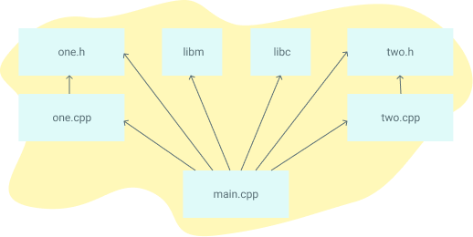

我编写这本指南是因为我对Makefiles总是摸不着头脑。它们似乎充斥着隐藏的规则和深奥的符号，问一些简单的问题并不能得到简单的答案。为了解决这个问题，我在几个周末里坐下来，阅读了所有关于Makefiles的资料。我把最关键的知识浓缩在本指南中。每个主题都有一个简短的描述和一个自带的例子，你可以自己运行。

如果你基本了解Make，可以考虑看看Makefile Cookbook，它有一个中等规模项目的模板，并对Makefile的每一部分做了充分的注释。

祝你好运，我希望你能在混乱的Makefile世界中大显身手。

# 入门

## 为什么会存在Makefiles？

Makefile用于帮助决定一个大型程序的哪些部分需要重新编译。在绝大多数情况下，C或C++文件被编译。其他语言通常有自己的工具，其作用与Make类似。它也可以在程序之外使用，当你需要根据哪些文件的变化来运行一系列指令时。本教程将重点介绍C/C++编译的使用情况。

下面是一个你可能用Make构建的依赖关系图的例子。如果任何文件的依赖关系发生变化，那么该文件将被重新编译。



## 有什么可以替代Make?

流行的C/C++替代构建系统有SCons、CMake、Bazel和Ninja。一些代码编辑器，如微软Visual Studio，也有自己的内置构建工具。对于Java，有Ant、Maven和Gradle。其他语言如Go和Rust也有自己的构建工具。

像Python、Ruby和Javascript这样的解释型语言不需要类似Makefiles的东西。Makefiles的目标是根据哪些文件发生了变化，来编译任何需要编译的文件。但是，当解释型语言的文件发生变化时，没有什么需要被重新编译的。当程序运行时，使用的是文件的最新版本。

## 运行示例

要运行这些例子，你需要一个终端和安装 "make"。对于每个例子，将其内容放在一个叫做Makefile的文件中，并在该目录下运行make命令。让我们从最简单的Makefile文件开始。

```makefile
hello:
    echo "hello world"
```

下面是运行上述例子的输出。

```
$ make
echo "hello world"
hello world
```

这就是了! 如果你有点困惑，这里有一个[视频](https://youtu.be/zeEMISsjO38)，介绍了这些步骤，同时描述了Makefiles的基本结构。

## Makefile语法

一个Makefile是由一组规则组成的。一个规则通常看起来像这样。

```makefile
targets: prerequisites
   command
   command
   command
```

* targets是文件名，用空格分隔。通常情况下，每条规则只有一个。
* command是一系列的步骤，通常用于制作targets。这些command需要以制表符开始，而不是空格。
* prerequisites也是文件名，用空格分隔。在运行targets的命令之前，这些文件需要存在。这些也被称为依赖项。

## 初学者例子

下面的 Makefile 有三个独立的规则。当你在终端运行make blah时，它将通过一系列步骤构建一个名为blah的程序。

* Make赋予**blah**作为target，所以它首先搜索这个目标
* **blah** 需要 **blah.o**，所以 make 会搜索 blah.o 这个target
* **blah.o**需要**blah.c**，所以make搜索**blah.c**
* **blah.c**没有依赖项，所以运行echo命令
* 然后运行 cc -c 命令，因为所有 blah.o 的依赖关系都已完成。
* 顶部的cc命令运行，因为所有 blah 的依赖关系都已完成。
* 就这样：**blah**是一个已编译的c程序


```makefile
blah: blah.o
    cc blah.o -o blah # Runs third

blah.o: blah.c
    cc -c blah.c -o blah.o # Runs second

blah.c:
    echo "int main() { return 0; }" > blah.c # Runs first
```

这个makefile有一个单一的目标，叫做some_file。默认的目标是第一个目标，所以在这种情况下，some_file将会运行。

```makefile
some_file:
    echo "This line will always print"
```

这个文件第一次会制作some_file，第二次会注意到它已经制作好了，结果是make：'some_file'是最新的。

```makefile
some_file:
    echo "This line will only print once"
    touch some_file
```

这里，target some_file "依赖于 "other_file。当我们运行make时，默认这里，target（some_file，因为它是第一个）将被调用。它首先会查看它的依赖列表，如果其中有任何一个是旧的，它将首先运行这些依赖的目标，然后再运行它自己。在第二次运行时，两个目标都不会运行，因为两个目标都存在。

```makefile
some_file: other_file
    echo "This will run second, because it depends on other_file"
    touch some_file

other_file:
    echo "This will run first"
    touch other_file
```

这将始终运行两个目标，因为some_file依赖于other_file，而other_file从未被创建。

```makefile
some_file: other_file
    touch some_file

other_file:
    echo "nothing"
```

clean经常被用作删除其他目标的输出的目标，但它在make中不是一个特殊的词。

```makefile
some_file: 
    touch some_file

clean:
    rm -f some_file
```

## 变量


